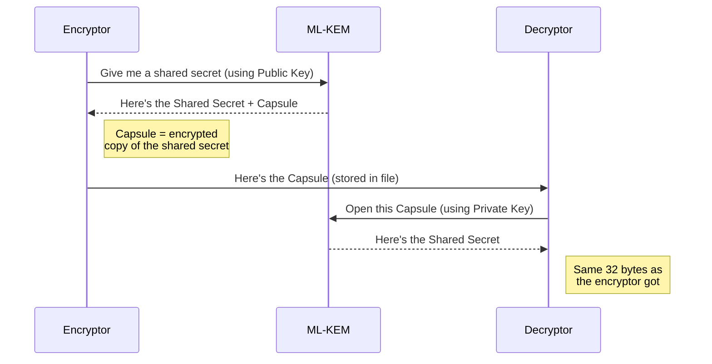
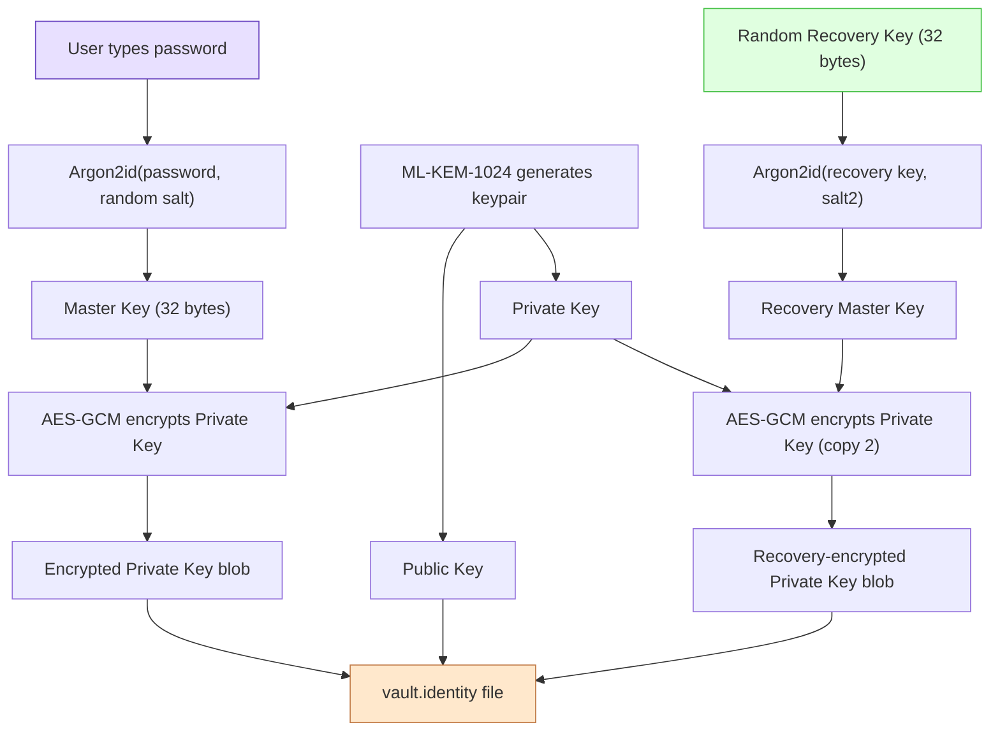
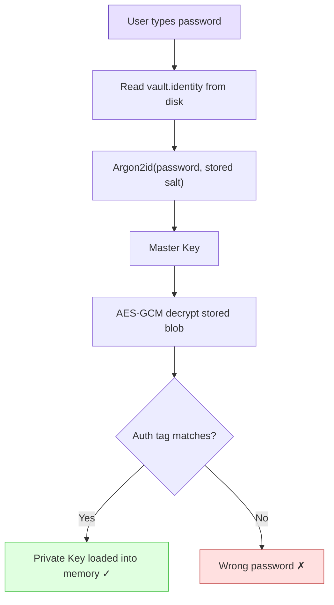
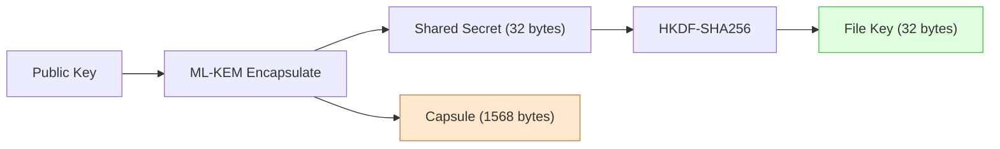
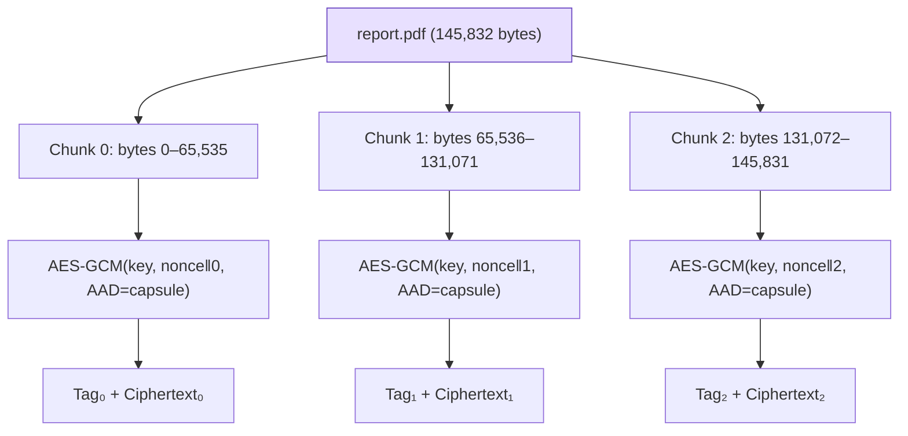
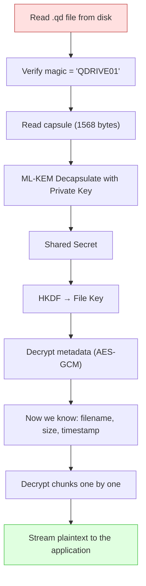
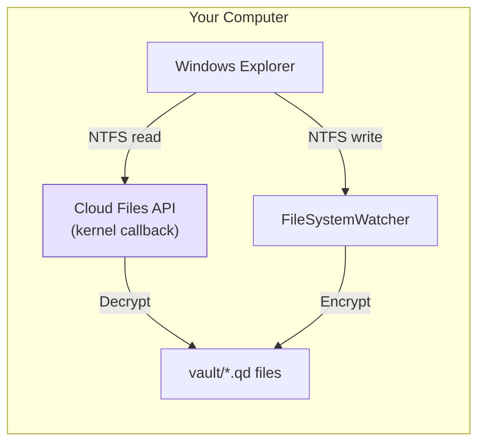
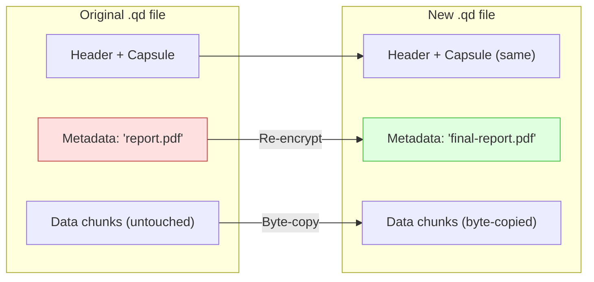
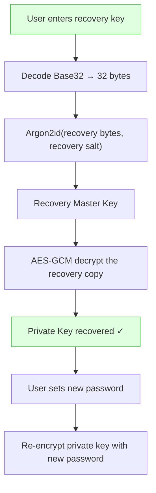

# QuantumDrive Encryption — How It All Works

> **Audience:** Someone with basic programming knowledge (CS freshman level).
> No prior cryptography experience needed — every concept is explained.
>
> **Last updated:** 2026-02-23 — Matches QDRIVE01 file format, Cloud Files API virtual drive.

---

## Table of Contents

1. [The Big Picture](#1-the-big-picture)
2. [Cryptography Crash Course](#2-cryptography-crash-course)
3. [The Key Players (Algorithms)](#3-the-key-players-algorithms)
4. [Creating a Vault](#4-creating-a-vault)
5. [Unlocking a Vault](#5-unlocking-a-vault)
6. [Encrypting a File (QDRIVE01 Format)](#6-encrypting-a-file-qdrive01-format)
7. [Decrypting a File](#7-decrypting-a-file)
8. [The Virtual Drive (How Files Appear Normal)](#8-the-virtual-drive-how-files-appear-normal)
9. [Special Operations](#9-special-operations)
10. [Recovery](#10-recovery)
11. [Password Strength Estimation](#11-password-strength-estimation)
12. [Security Properties — What We Protect Against](#12-security-properties--what-we-protect-against)
13. [Glossary](#13-glossary)

---

## 1. The Big Picture

QuantumDrive creates an encrypted folder ("vault") on your computer. When you
unlock the vault with your password, a virtual drive letter (like `Q:`) appears
in Windows Explorer. You drag files in and out like a normal folder — but behind
the scenes, every file is encrypted before it touches disk and decrypted on the
fly when you open it.

When you lock the vault (or close the app), the drive disappears and all that
remains on disk is a folder of `.qd` files that are completely unreadable
without your password.

```mermaid
flowchart LR
    subgraph You see
        A["Q: drive in Explorer"]
        B["report.pdf"]
        C["photo.jpg"]
    end

    subgraph On disk (encrypted)
        D["vault/a3f8c1.qd"]
        E["vault/7b2e90.qd"]
    end

    B -- "Write to Q:" --> D
    E -- "Read from Q:" --> C

    style A fill:#e8e0ff,stroke:#6b46c1
    style D fill:#ffe0e0,stroke:#c14646
    style E fill:#ffe0e0,stroke:#c14646
```

**The golden rule:** Your actual files never exist unencrypted on disk. The
plaintext only ever lives in memory, for the brief moment it's being read or
written.

---

## 2. Cryptography Crash Course

If you already know the difference between symmetric and asymmetric encryption,
skip to [Section 3](#3-the-key-players-algorithms).

### Symmetric encryption (one key)

Like a padlock where the same key locks and unlocks it. Fast, but you have to
share the key somehow.

```
Plaintext + Key → 🔒 Ciphertext
Ciphertext + Key → 🔓 Plaintext
```

**Example:** AES-256-GCM (what we use for file data).

### Asymmetric encryption (two keys)

Two mathematically linked keys: a **public key** (anyone can have it) and a
**private key** (only you have it). What one key encrypts, only the other can
decrypt.

```
Plaintext + Public Key  → 🔒 Ciphertext
Ciphertext + Private Key → 🔓 Plaintext
```

**Example:** ML-KEM-1024 (what we use — explained below).

### Authenticated encryption

Regular encryption hides data, but an attacker could flip bits in the
ciphertext and you'd never know. **Authenticated encryption** adds an
"authentication tag" — a fingerprint of the ciphertext. If anyone modifies
even one bit, decryption fails immediately instead of giving you corrupted data.

AES-GCM does both encryption + authentication in one step.

### Key derivation

Turning something you know (a password) into a proper encryption key. Passwords
are too short/predictable to use directly, so we run them through a slow,
memory-hard function that makes brute-force guessing expensive.

### Nonce ("number used once")

A random value mixed into each encryption. It ensures that encrypting the same
file twice produces completely different ciphertext — so an attacker can't tell
if two files are identical.

---

## 3. The Key Players (Algorithms)

| Algorithm | Type | What it does in QuantumDrive |
|-----------|------|------------------------------|
| **ML-KEM-1024** | Asymmetric (post-quantum) | Generates a unique encryption key per file |
| **AES-256-GCM** | Symmetric (authenticated) | Actually encrypts/decrypts file data |
| **HKDF-SHA256** | Key derivation | Strengthens the ML-KEM output into a proper AES key |
| **Argon2id** | Password hashing | Converts your password into a key to protect the private key |

### Why ML-KEM? (The quantum threat)

Today's asymmetric crypto (RSA, ECC) relies on math problems that quantum
computers will eventually solve. ML-KEM (Module-Lattice Key Encapsulation
Mechanism) is based on a different kind of math (lattice problems) that quantum
computers can't crack. It's a **NIST standard** (FIPS 203), meaning it was
vetted and approved by the US government's cryptography institute.

ML-KEM doesn't directly encrypt data. Instead it does a "key handshake":



Both sides now have the same 32-byte shared secret, which we feed into HKDF to
get the AES key. This is called **KEM** (Key Encapsulation Mechanism) — the
standard pattern for post-quantum crypto.

---

## 4. Creating a Vault

When you create a vault for the first time, here's what happens:



### What gets saved in `vault.identity`:

| Field | What it is |
|-------|-----------|
| `Salt` | Random 32 bytes — used with Argon2id to derive the master key |
| `Nonce` | Random 12 bytes — used for the AES-GCM encryption of the private key |
| `EncryptedMlKemPrivateKey` | The private key, encrypted with your password-derived master key |
| `MlKemPublicKey` | The public key in plaintext (this is safe — public keys are meant to be public) |
| `RecoverySalt`, `RecoveryNonce`, `RecoveryEncryptedMlKemPrivateKey` | A second encrypted copy of the private key, protected by the recovery key instead of your password |

### The Argon2id parameters:

| Parameter | Value | Why |
|-----------|-------|-----|
| Memory | 64 MB | Forces attacker to use 64 MB RAM per guess — makes GPU attacks impractical |
| Iterations | 3 | Three passes over memory — more work per guess |
| Parallelism | 4 | Uses 4 CPU threads — optimized for modern CPUs |

With these settings, each password guess takes about 0.5–1 second on a modern
computer. An attacker trying billions of passwords would need centuries.

---

## 5. Unlocking a Vault



The beauty: if the password is wrong, Argon2id derives a *different* master key,
and AES-GCM's authentication tag won't match. We know immediately — no risk of
silently decrypting to garbage.

Once unlocked, the **private key** and **public key** live in memory for the
duration of the session. They're used to encrypt/decrypt every file you touch.

---

## 6. Encrypting a File (QDRIVE01 Format)

This is the core of QuantumDrive. When you save `report.pdf` to the `Q:` drive,
here's every step that happens:

### Step 1: Generate a unique file key



Every file gets its own ML-KEM encapsulation. This means every file has a
**unique key** — if one file's key is somehow compromised, no other files are
affected.

The HKDF step takes the raw ML-KEM shared secret and "stretches" it into a
proper AES key. This is defense-in-depth: even if there's a subtle weakness in
ML-KEM's output distribution, HKDF smooths it into a uniformly random key.

### Step 2: Encrypt metadata

The file's metadata (original filename, size, timestamp) is serialized to JSON
and encrypted with AES-256-GCM:

```
Metadata plaintext:  {"OriginalName":"report.pdf","OriginalSize":145832,"UploadedAt":"2026-02-16T..."}
                           ↓
                  AES-GCM(File Key, random nonce, AAD=capsule)
                           ↓
Metadata ciphertext:  [encrypted bytes]  +  Tag (16 bytes)
```

**AAD (Additional Authenticated Data):** We pass the capsule as AAD. This
doesn't encrypt the capsule — it *binds* the metadata to this specific capsule.
If an attacker tries to swap the capsule from one file into another, the
authentication tag won't match and decryption fails.

### Step 3: Encrypt data in chunks

The file data is split into 64 KB (65,536 byte) chunks. Each chunk is
independently encrypted with AES-256-GCM:



**Nonce construction:** Each chunk needs a unique nonce (reusing a nonce with
AES-GCM is catastrophic). We generate a random 8-byte prefix once per file,
then append a 4-byte counter:

```
Chunk 0 nonce: [random 8 bytes] [00 00 00 00]   ← counter = 0
Chunk 1 nonce: [random 8 bytes] [00 00 00 01]   ← counter = 1
Chunk 2 nonce: [random 8 bytes] [00 00 00 02]   ← counter = 2
```

This guarantees unique nonces for up to 4 billion chunks per file (256 TB at
64 KB/chunk — more than enough).

### The complete QDRIVE01 file layout

```
┌──────────────────────────────────────────────────────────────┐
│ "QDRIVE01"                                    (8 bytes)      │ ← Magic identifier
│ ML-KEM Capsule                                (1568 bytes)   │ ← Encrypted shared secret
├──────────────────────────────────────────────────────────────┤
│ Metadata Nonce                                (12 bytes)     │ ← Random, for metadata AES-GCM
│ Metadata Ciphertext Length                    (4 bytes)      │ ← So we know how much to read
│ Metadata Auth Tag                             (16 bytes)     │ ← Tamper-detection fingerprint
│ Metadata Ciphertext                           (variable)     │ ← Encrypted JSON
├──────────────────────────────────────────────────────────────┤
│ Data Nonce Prefix                             (8 bytes)      │ ← Random, combined with counter
│ Chunk 0: Auth Tag (16) + Ciphertext (≤ 64 KB)               │
│ Chunk 1: Auth Tag (16) + Ciphertext (≤ 64 KB)               │
│ ...                                                          │
│ Last Chunk: Auth Tag (16) + Ciphertext (1–64 KB)             │
└──────────────────────────────────────────────────────────────┘
```

**Example sizes for a 1 MB file:**

| Section | Size |
|---------|------|
| Magic | 8 bytes |
| Capsule | 1,568 bytes |
| Metadata section | ~100 bytes |
| Nonce prefix | 8 bytes |
| Data (16 chunks × (16-byte tag + 64 KB)) | 1,049,344 bytes |
| **Total overhead** | **~1.7 KB + 16 bytes per 64 KB chunk** |

That's about **0.2% overhead** — you barely notice it.

---

## 7. Decrypting a File

Decryption is the exact reverse:



### Streaming (constant memory)

This is a key design choice. We do **not** load the entire file into memory.
Instead:

1. Read one 64 KB chunk from disk
2. Decrypt it in a ~128 KB buffer
3. Send the plaintext to the requesting application
4. Reuse the same buffer for the next chunk

A 10 GB video file uses the same ~128 KB of memory as a 1 KB text file.

---

## 8. The Virtual Drive (How Files Appear Normal)

The magic that makes encrypted files look like a normal folder is the **Windows
Cloud Files API** (CldApi). This is the same technology that powers OneDrive,
Dropbox, and Box. QuantumDrive registers as a cloud sync provider and creates
NTFS **placeholder files** that look and behave exactly like regular local files.



### What happens when you open a file:

1. You double-click `Q:\report.pdf` in Explorer
2. The CldFlt minifilter (a kernel component) intercepts the read
3. A `FETCH_DATA` callback fires on our `CloudSyncProvider`
4. The provider looks up `report.pdf` in its index to find the matching `.qd` file
5. It reads the `.qd` file, decrypts it chunk-by-chunk (streaming)
6. It transfers the decrypted bytes to the placeholder via `CfExecute`
7. Your PDF viewer receives the bytes — it has no idea encryption happened

Because the file is a native NTFS file, applications like Microsoft Office open
it without Protected View restrictions (unlike WebDAV-mounted drives).

### What happens when you save a file:

1. Your application saves to `Q:\report.pdf`
2. A `FileSystemWatcher` on the sync root detects the write
3. After a short debounce, `CloudSyncProvider` reads the modified file
4. It encrypts the data chunk-by-chunk into a new `.qd` file in the vault
5. The file index is updated with the new file's metadata

### The file index

The provider maintains an in-memory index mapping `filename → .qd file path`.
When it starts up, it reads just the **header** (~2 KB) of each `.qd` file to
extract the encrypted metadata (filename, size). It does NOT read the full file
contents — so even a vault with thousands of files loads quickly.

```
Index:
  "report.pdf"  → vault/a3f8c1.qd  (145,832 bytes, uploaded 2026-02-16)
  "photo.jpg"   → vault/7b2e90.qd  (3,245,101 bytes, uploaded 2026-02-15)
```

A `FileSystemWatcher` keeps this index updated in real-time when `.qd` files
are added, modified, or deleted on disk.

---

## 9. Special Operations

### Renaming / Moving a file

When you rename `report.pdf` to `final-report.pdf`:

**Naive approach:** Decrypt the entire file, re-encrypt with the new filename.
For a 1 GB file, this would take seconds and require gigabytes of I/O.

**Our approach (`RewriteMetadataAsync`):**

1. Read just the header (capsule + metadata section)
2. Decrypt the metadata → change the filename → re-encrypt metadata
3. Byte-copy the data section untouched



Renaming a 1 GB file takes ~2 ms instead of seconds because we only touch
the tiny metadata section. The data chunks are identical — same capsule,
same key, same nonces — so we just copy them byte for byte.

### Reading metadata without decrypting data

The `ReadMetadataAsync` operation reads only the first ~2 KB of a `.qd` file
(the header + metadata section). It never touches the data chunks. This is used
for:

- Building the file index at startup
- Showing file listings in Explorer (PROPFIND)
- Checking file sizes and timestamps

---

## 10. Recovery

If you forget your password, you can recover using a **recovery key** — a
Base32-encoded string (like `ABCD-EFGH-IJKL-...`) generated during vault
creation.



The vault.identity file stores **two** encrypted copies of the private key:

1. One encrypted with your password (for daily use)
2. One encrypted with the recovery key (for emergencies)

Both protect the same private key. The recovery key is a random 256-bit value
(as strong as the encryption keys themselves), so it's immune to dictionary
attacks.

---

## 11. Password Strength Estimation

When you type your password during vault creation, the app estimates its
strength. The estimator goes beyond simple "has uppercase + number" checks:

| Check | What it detects | Penalty |
|-------|----------------|---------|
| Character class pool | How many possible characters (a-z = 26, + A-Z = 52, etc.) | Base calculation |
| Repeated characters | "aaaa1111" → low diversity | Up to 50% reduction |
| Sequential runs | "abc", "123", "qwerty" | 15% per run found |
| Common passwords | Contains "password", "qwerty", "123456", etc. | 70% reduction |
| Single character class | All digits or all lowercase | 40% reduction |

The result is expressed in **entropy bits**. More bits = harder to crack:

| Entropy | Strength | Time to crack at 1B guesses/sec |
|---------|----------|-------------------------------|
| < 28 bits | Very Weak | Instantly |
| 28–49 bits | Weak | Minutes to days |
| 50–59 bits | Moderate | Years |
| 60–79 bits | Strong | Centuries |
| 80+ bits | Exceptional | Longer than the universe has existed |

---

## 12. Security Properties — What We Protect Against

### Things we protect against

| Threat | How |
|--------|-----|
| **Stolen laptop** | Files encrypted at rest — unreadable without password |
| **Quantum computers** | ML-KEM-1024 is quantum-resistant (NIST Level 5) |
| **Password guessing** | Argon2id makes each guess cost ~1 second and 64 MB RAM |
| **File tampering** | AES-GCM auth tags detect any modification |
| **Filename leakage** | Filenames encrypted inside the .qd file (not visible on disk) |
| **Key reuse** | Every file gets its own unique key via ML-KEM encapsulation |
| **Identical file detection** | Same file encrypted twice produces completely different ciphertext |
| **Capsule swapping** | Capsule used as AAD — moving a capsule between files breaks authentication |

### Things we do NOT protect against (yet)

| Limitation | Why | Planned for v2 |
|-----------|-----|----------------|
| Attacker with admin access on running machine | Can read decrypted data from memory | Memory pinning |
| File count visible | Attacker can count `.qd` files in the vault folder | File padding |
| Approximate file size visible | `.qd` file size ≈ original size + 0.2% overhead | Container format |
| Chunk reordering by local attacker | No Merkle tree to verify chunk order | Merkle commitment |

---

## 13. Glossary

| Term | Definition |
|------|-----------|
| **AAD** | Additional Authenticated Data — extra data fed into AES-GCM that is verified but not encrypted. We use the ML-KEM capsule as AAD. |
| **AES-256-GCM** | Advanced Encryption Standard with 256-bit key in Galois/Counter Mode. Provides both confidentiality (hiding data) and integrity (detecting tampering). |
| **Argon2id** | A password hashing function that's intentionally slow and memory-hungry. Winner of the Password Hashing Competition (2015). |
| **Authentication tag** | A short (16-byte) fingerprint computed during encryption. If the ciphertext is modified, the tag won't match and decryption fails. |
| **Capsule** | The output of ML-KEM encapsulation — essentially an encrypted copy of the shared secret that only the private key holder can open. 1,568 bytes. |
| **Ciphertext** | Encrypted data. Looks like random bytes. |
| **Encapsulation** | The ML-KEM operation that produces a shared secret + capsule using a public key. |
| **HKDF** | HMAC-based Key Derivation Function. Takes "okay" key material and produces cryptographically strong keys. |
| **KEM** | Key Encapsulation Mechanism — a way for two parties to agree on a shared secret using asymmetric cryptography. |
| **ML-KEM-1024** | Module-Lattice Key Encapsulation Mechanism at security level 5. NIST FIPS 203. Post-quantum secure. |
| **Nonce** | A number used exactly once for a specific encryption. Reusing a nonce with the same key catastrophically breaks AES-GCM security. |
| **Plaintext** | Unencrypted, human-readable data. |
| **Post-quantum** | Cryptography that remains secure even if quantum computers become powerful enough to break traditional crypto (RSA, ECC). |
| **Private key** | The secret half of an asymmetric keypair. Must never be shared. Used to decapsulate (open capsules). |
| **Public key** | The shareable half of an asymmetric keypair. Used to encapsulate (create capsules). Knowing it doesn't help you decrypt. |
| **Shared secret** | A value known to both the encryptor and decryptor but no one else. Derived from ML-KEM encapsulation/decapsulation. |
| **Streaming** | Processing data in small pieces (chunks) instead of loading the entire file into memory. |
| **Vault** | A QuantumDrive encrypted folder. Contains `.qd` encrypted files and a `.quantum_vault/vault.identity` key file. |
| **Cloud Files API** | Windows API (CldApi) that allows apps to register as cloud sync providers. Creates NTFS placeholder files that are transparently hydrated on demand via kernel callbacks. Used by OneDrive, Dropbox, and QuantumDrive. |

---

## Appendix: End-to-End Example

Let's trace what happens when you save a 150 KB file called `notes.txt` to
your QuantumDrive vault:

```
1. You drag notes.txt onto Q: drive

2. FileSystemWatcher detects the new file in the sync root folder

3. CloudSyncProvider encrypts the file:
   ├─ ML-KEM Encapsulate(public_key)
   │   ├─ capsule    = [1568 random-looking bytes]
   │   └─ shared_secret = [32 bytes]
   │
   ├─ HKDF(shared_secret, info="qdrive1-fek")
   │   └─ file_key = [32 bytes]         ← the AES key for this file
   │
   ├─ Build metadata JSON:
   │   {"OriginalName":"notes.txt","OriginalSize":150000,"UploadedAt":"..."}
   │
   ├─ Write to a3f8c1.qd:
   │   ├─ "QDRIVE01"                     (8 bytes, magic)
   │   ├─ capsule                        (1568 bytes)
   │   ├─ random meta nonce              (12 bytes)
   │   ├─ metadata ciphertext length     (4 bytes → ~80)
   │   ├─ metadata auth tag              (16 bytes)
   │   ├─ encrypted metadata JSON        (~80 bytes)
   │   ├─ random nonce prefix            (8 bytes)
   │   │
   │   ├─ Chunk 0 (bytes 0–65535 of notes.txt):
   │   │   ├─ nonce = prefix‖00000000
   │   │   ├─ AES-GCM encrypt(file_key, nonce, chunk, AAD=capsule)
   │   │   ├─ write auth tag             (16 bytes)
   │   │   └─ write ciphertext           (65536 bytes)
   │   │
   │   ├─ Chunk 1 (bytes 65536–131071):
   │   │   ├─ nonce = prefix‖00000001
   │   │   └─ ... same process ...       (16 + 65536 bytes)
   │   │
   │   └─ Chunk 2 (bytes 131072–149999):
   │       ├─ nonce = prefix‖00000002
   │       └─ ... same process ...       (16 + 18928 bytes)
   │
   ├─ Wipe file_key from memory
   └─ Update file index: "notes.txt" → a3f8c1.qd

4. Windows Explorer shows notes.txt on Q: drive ✓
   On disk: only a3f8c1.qd exists (completely unreadable gibberish)
```

**Total .qd file size:** 8 + 1568 + 12 + 4 + 16 + ~80 + 8 + (3 × 16) + 150,000
= **~151,744 bytes** (1.2% overhead).

**Memory used during encryption:** ~128 KB (two 64 KB buffers) — regardless of
whether the file is 1 KB or 100 GB.
